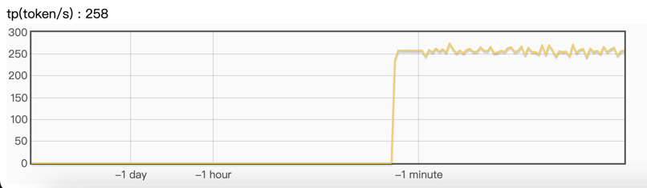
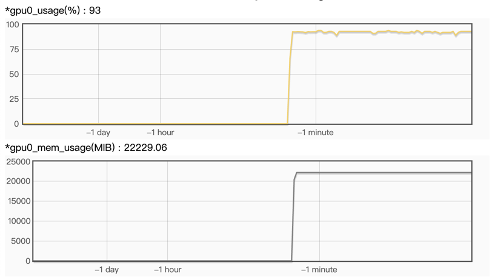

# grps-vllm

[grps](https://github.com/NetEase-Media/grps)接入[vllm](https://docs.vllm.ai/en/stable/)使用```LLMEngine Api```
实现LLM服务，同```vllm-api-server```
相比较服务性能有所提升。后续会支持```OpenAI```接口协议，包含```chat```与```function call```。

1. [工程结构](#1-工程结构)
2. [本地开发与调试](#2-本地开发与调试)
3. [docker部署服务](#3-docker部署服务)
4. [客户端请求](#4-客户端请求)
5. [服务指标监控](#5-服务指标监控)
6. [关闭docker服务](#6-关闭docker服务)
7. [同vllm-api-server相比](#7-同vllm-api-server相比)

## 1. 工程结构

```text
|-- client                                      # 客户端样例
|-- conf                                        # 配置文件
|   |-- inference.yml                           # 推理配置
|   |-- server.yml                              # 服务配置
|-- data                                        # 数据文件
|-- docker                                      # docker镜像构建
|-- src                                         # 自定义源码
|   |-- customized_inferer.py                   # 自定义推理器
|-- grps_framework-*-py3-none-any.whl           # grps框架依赖包，仅用于代码提示
|-- requirements.txt                            # 依赖包
|-- test.py                                     # 本地单元测试
```

## 2. 本地开发与调试

```bash
# 使用registry.cn-hangzhou.aliyuncs.com/opengrps/grps_gpu:grps1.1.0_cuda11.8_cudnn8.6_vllm0.4.3_py3.10镜像
docker run -it --runtime=nvidia --rm --shm-size=2g --ulimit memlock=-1 -v $(pwd):/grps_dev -w /grps_dev registry.cn-hangzhou.aliyuncs.com/opengrps/grps_gpu:grps1.1.0_cuda11.8_cudnn8.6_vllm0.4.3_py3.10 bash

# 修改conf/inference.yml中的vllm模型参数，如使用THUDM/chatglm3-6b模型
inferer_args: # more args of model inferer.
  model: "THUDM/chatglm3-6b"
  trust_remote_code: true
  dtype: bfloat16
  tensor_parallel_size: 1
  gpu_memory_utilization: 0.9
  device: auto

# 跳过单测直接构建
grpst archive . --skip_unittest

# 部署，超时时间可以设置大一些，下载模型需要时间，如1200s
# 首次构建完后，修改配置后可以直接启动服务无需重新构建，通过--inference_conf以及--server_conf参数指定.
# grpst start --inference_conf=conf/inference.yml --server_conf=conf/server.yml
grpst start ./server.mar --timeout 1200

# 查看部署状态，可以看到端口（HTTP,RPC）、服务名、进程ID、部署路径
grpst ps
PORT(HTTP,RPC)      NAME                PID                 DEPLOY_PATH
7080                my_grps             ***                 /root/.grps/my_grps

# 非流式请求
curl -X POST -H "Content-Type:application/json" -d '{"prompt": "华盛顿是谁? ", "temperature": 0.1, "top_p": 0.5, "max_tokens": 4096}' 'http://127.0.0.1:7080/generate'
# 输出结果如下：
# 华盛顿(George Washington)是美国的一位政治家和将军,也是美国独立战争期间的指挥官,还是美国第一任总统。他出生于1732年,逝世于1799年。他被认为是美国历史上最伟大的领袖之一,因为他在美国革命战争期间的英勇行为和后来的政治领导能力。他建立了许多重要的政治制度和政策,对美国的发展和进步做出了巨大贡献。

# 流式请求
curl --no-buffer -X POST -H "Content-Type:application/json" -d '{"prompt": "华盛顿是谁? ", "temperature": 0.1, "top_p": 0.5, "max_tokens": 4096}' 'http://127.0.0.1:7080/generate?streaming=true'
# 输出结果如下：
# 华盛顿(George Washington)是美国的一位政治家和将军,也是美国独立战争期间的指挥官,还是美国第一任总统。他出生于1732年,逝世于1799年。他被认为是美国历史上最伟大的领袖之一,因为他在美国革命战争期间的英勇行为和后来的政治领导能力。他建立了许多重要的政治制度和政策,对美国的发展和进步做出了巨大贡献。

# 退出
exit
```

## 3. docker部署服务

```bash
# 构建自定义工程docker镜像
docker build -t vllm_online:1.0.0 -f docker/Dockerfile .

# 启动docker容器
docker run -itd --runtime=nvidia --name="vllm_online" --shm-size=2g --ulimit memlock=-1 -p 7080:7080 vllm_online:1.0.0

# 查看日志
docker logs -f vllm_online
```

## 4. 客户端请求

### 4.1 curl客户端

```bash
# 非流式请求
curl -X POST -H "Content-Type:application/json" -d '{"prompt": "华盛顿是谁? ", "temperature": 0.1, "top_p": 0.5, "max_tokens": 4096}' 'http://127.0.0.1:7080/generate'
# 输出结果如下：
# 华盛顿(George Washington)是美国的一位政治家和将军,也是美国独立战争期间的指挥官,还是美国第一任总统。他出生于1732年,逝世于1799年。他被认为是美国历史上最伟大的领袖之一,因为他在美国革命战争期间的英勇行为和后来的政治领导能力。他建立了许多重要的政治制度和政策,对美国的发展和进步做出了巨大贡献。

# 流式请求
curl --no-buffer -X POST -H "Content-Type:application/json" -d '{"prompt": "华盛顿是谁? ", "temperature": 0.1, "top_p": 0.5, "max_tokens": 4096}' 'http://127.0.0.1:7080/generate?streaming=true'
# 输出结果如下：
# 华盛顿(George Washington)是美国的一位政治家和将军,也是美国独立战争期间的指挥官,还是美国第一任总统。他出生于1732年,逝世于1799年。他被认为是美国历史上最伟大的领袖之一,因为他在美国革命战争期间的英勇行为和后来的政治领导能力。他建立了许多重要的政治制度和政策,对美国的发展和进步做出了巨大贡献。
```

## 5. 服务指标监控

登录```http://ip:port/```即可查看指标监控，在vllm后端中增加了tp吞吐量的监控（包含输入token），如下：<br>
<br>

以及grps内置GPU监控：<br>


## 6. 关闭docker服务

```bash
docker rm -f vllm_online
```

## 7. 同vllm api-server相比

grps-vllm通过LLMEngine同步api进行实现，同vllm api-server相比较使用的服务性能有所提升，例如使用如下环境进行测试：

```
GPU: RTX 3090
VLLM: 0.4.3
CUDA: 11.8
GRPS: 1.1.0
LLM: THUDM/chatglm3-6b
```

固定输入：

| 服务 \ 吞吐(tokens/s) \ 并发 | 1      | 2      | 4      | 8      | 16      | 32      |
|------------------------|--------|--------|--------|--------|---------|---------|
| vllm api-server        | 107.47 | 199.28 | 378.50 | 709.28 | 1255.43 | 2119.44 |
| grps vllm自定义服务         | 112.32 | 208.24 | 405.12 | 775.42 | 1422.19 | 2486.66 |
| 同比                     | 4.51%  | 4.50%  | 7.03%  | 9.32%  | 13.28%  | 17.33%  | 

随机输入：

| 服务 \ 吞吐(tokens/s) \ 并发 | 1      | 2      | 4      | 8      | 16      | 32      |
|------------------------|--------|--------|--------|--------|---------|---------|
| vllm api-server        | 102.36 | 188.54 | 360.36 | 679.35 | 1166.75 | 1914.54 |
| grps vllm自定义服务         | 105.90 | 196.56 | 373.07 | 721.21 | 1313.45 | 2199.39 |
| 同比                     | 3.46%  | 4.25%  | 3.53%  | 6.16%  | 12.57%  | 14.88%  | 

vllm api-server使用如下方式启动：

```bash
python -m vllm.entrypoints.api_server --model THUDM/chatglm3-6b --trust-remote-code --port 7080
```

使用如下benchmark脚本测试：

```
python3 client/python/grps_http_bench.py <concurrency> <random_prompt>
python3 client/python/vllm_http_bench.py <concurrency> <random_prompt>
```
